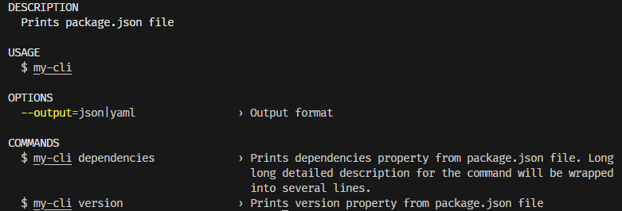
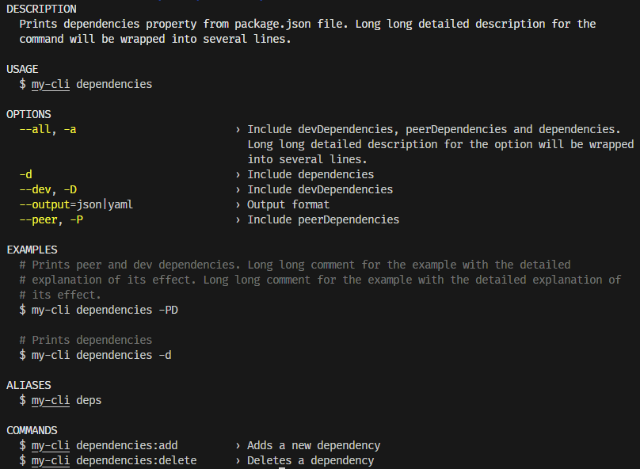
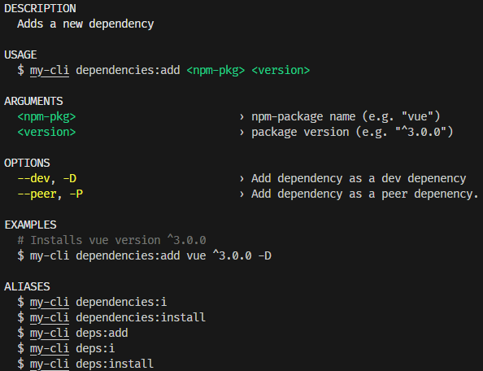

<p align="center">

<p align="center">
<a  href="https://github.com/prostojs/cli-help/blob/main/LICENSE">
    
</a>
</p>
</p>

## CLI Help Renderer

Lightweight and simple cli-help renderer, that supports:

-   commands with arguments
-   options
-   aliases

## Install

npm: `npm install @prostojs/cli-help`

## Usage

Here's a dumb example of random CLI that does some operations over package.json file.
The intent is to show the capabilities of the cli-help rendere only.

```js
// example.js
const { CliHelpRenderer } = require('@prostojs/cli-help')

const chr = new CliHelpRenderer({
    name: 'my-cli',
    mark: '›',
})
const commonOptions = [
    {
        keys: ['output'],
        description: 'Output format',
        value: 'json|yaml',
    },
]
chr.addEntry(
    {
        command: '',
        description: 'Prints package.json file',
        options: [...commonOptions],
    },
    {
        command: 'version',
        description: 'Prints version property from package.json file',
        aliases: ['v'],
    },
    {
        command: 'version set',
        description: 'Sets <new-version> as version for package.json file',
        aliases: ['vs'],
        args: {
            'new-version': 'Version value (e.g. "1.0.2")',
        },
        examples: [{ cmd: '1.0.2', description: 'Sets version to 1.0.2' }],
    },
    {
        command: 'dependencies',
        description:
            'Prints dependencies property from package.json file. ' +
            'Long long detailed description for the command will be wrapped into several lines.',
        aliases: ['deps'],
        options: [
            ...commonOptions,
            {
                keys: ['peer', 'P'],
                description: 'Include peerDependencies',
            },
            {
                keys: ['dev', 'D'],
                description: 'Include devDependencies',
            },
            {
                keys: ['d'],
                description: 'Include dependencies',
            },
            {
                keys: ['all', 'a'],
                description:
                    'Include devDependencies, peerDependencies and dependencies. ' +
                    'Long long detailed description for the option will be wrapped into several lines.',
            },
        ],
        examples: [
            {
                cmd: '-PD',
                description:
                    'Prints peer and dev dependencies. ' +
                    'Long long comment for the example with the detailed explanation of its effect. '.repeat(
                        2
                    ),
            },
            { cmd: '-d', description: 'Prints dependencies' },
        ],
    },
    {
        command: 'dependencies:add',
        aliases: ['dependencies:i', 'dependencies:install'],
        description: 'Adds a new dependency',
        options: [
            {
                keys: ['dev', 'D'],
                description: 'Add dependency as a dev depenency',
            },
            {
                keys: ['peer', 'P'],
                description: 'Add dependency as a peer depenency.',
            },
        ],
        args: {
            'npm-pkg': 'npm-package name (e.g. "vue")',
            version: 'package version (e.g. "^3.0.0")',
        },
        examples: [
            {
                description: 'Installs vue version ^3.0.0',
                cmd: 'vue ^3.0.0 -D',
            },
        ],
    },
    {
        command: 'dependencies:delete',
        aliases: ['dependencies:del'],
        description: 'Deletes a dependency',
        args: {
            'npm-pkg': 'npm-package name (e.g. "vue")',
        },
        examples: [
            {
                description: 'Deletes vue dependency',
                cmd: 'vue',
            },
        ],
    }
)

// printing help based on process.argv command
chr.print(process.argv.slice(2).join(' ') || '', true)
```

The example above will result in the following output:

`node ./example.js`
<p align="center">

</p>

`node ./example.js dependencies`
<p align="center">

</p>

`node ./example.js deps:add`
<p align="center">

</p>


## Options

```js
chr.print('', true) // for root command tree and colored
chr.print('', false) // for root command tree and without colors
chr.print('deps') // for deps command tree and without colors

chr.render('deps', 100, false) // render help for fix command tree,
// max width = 100 columns, no colors
// returns string[]
```
