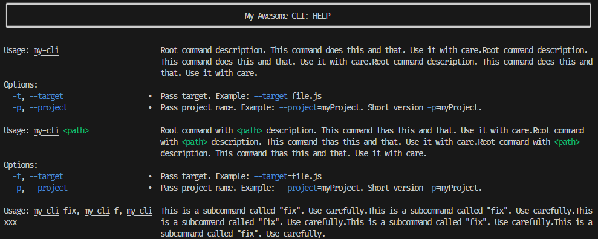

<p align="center">

<p align="center">
<a  href="https://github.com/prostojs/cli-help/blob/main/LICENSE">
    
</a>
</p>
</p>

## CLI Help Renderer

Lightweight and simple cli-help renderer, that supports:

 - commands with arguments
 - options
 - aliases

## Install

npm: `npm install @prostojs/cli-help`

## Usage

```js
const { CliHelpRenderer } = require('@prostojs/cli-help')

const chr = new CliHelpRenderer({
    name: 'my-cli',
    title: 'My Awesome CLI: HELP',
})
const options = [
    {
        keys: ['t', 'target'],
        description: 'Pass target. Example: --target=file.js',
    },
    {
        keys: ['p', 'project'],
        description:
            'Pass project name. Example: --project=myProject. Short version -p=myProject.',
    },
]
chr.addEntry({
    command: '',
    description:
        'Root command description. This command does this and that. Use it with care.'.repeat(
            3
        ),
    options,
})
chr.addEntry({
    command: '',
    args: ['path'],
    description:
        'Root command with <path> description. This command thas this and that. Use it with care.'.repeat(
            3
        ),
    options,
})
chr.addEntry({
    command: 'fix',
    description: 'This is a subcommand called "fix". Use carefully.'.repeat(5),
    aliases: ['f', 'xxx'],
})

chr.print('', true)
```



## Options

```js
chr.print('', true)  // for root command tree and colored
chr.print('', false) // for root command tree and without colors
chr.print('fix')     // for fix command tree and without colors

chr.render('fix', 100, false) // render help for fix command tree,
                              // max width = 100 columns, no colors
                              // returns string[]
```